<p align="center">
  
  
  
  
</p>

<h1 align="center">
  🛡️ VulnScan
</h1>

<p align="center">
  
</p>

<h3 align="center">🔥 Advanced Linux Vulnerability Scanner for Bug Bounty & Penetration Testing 🔥</h3>

<p align="center">
  <b>Self-contained • Zero Dependencies • No Root Required</b>
</p>

<p align="center">
  <a href="#-features">Features</a> •
  <a href="#%EF%B8%8F-quick-start">Quick Start</a> •
  <a href="#-how-it-works">How It Works</a> •
  <a href="#-output--reports">Reports</a> •
  <a href="#-configuration">Config</a> •
  <a href="#-disclaimer">Disclaimer</a>
</p>

---

## 🎯 What is VulnScan?

**VulnScan** is a **single-file, fully self-contained** Linux vulnerability scanner designed for **bug bounty hunters** and **penetration testers**. It embeds [LinPEAS](https://github.com/carlospolop/PEASS-ng) directly inside the script, runs a full system enumeration, and then cross-references every finding against **live CVE databases** — all without needing root privileges.

> **One file. One command. Complete vulnerability assessment.**

---

## ✨ Features

<table>
<tr>
<td width="50%">

### 🔍 Reconnaissance
- 🐧 **Embedded LinPEAS** — No separate download needed
- 📦 **Package Auditing** — Scans installed packages for known CVEs
- 🔑 **SUID/SGID Analysis** — Cross-references 150+ GTFOBins entries
- 🌐 **Service Enumeration** — Maps running services & open ports
- 🐳 **Container Detection** — Docker / LXC / Kubernetes awareness

</td>
<td width="50%">

### 💀 Exploit Detection
- 🔴 **Kernel Exploits** — DirtyPipe, DirtyCow, PwnKit, Baron Samedit, GameOver(lay)
- 🟡 **Misconfiguration Checks** — Writable passwd/shadow, Docker socket, NOPASSWD sudo
- 🟠 **CVE Database Lookups** — Real-time queries to CVE CircL + NIST NVD
- 🔵 **SSH Key Exposure** — Detects readable private keys
- 🟢 **Environment File Leaks** — Finds exposed `.env` files with secrets

</td>
</tr>
</table>

### ⚡ Key Highlights

| Feature | Description |
|:--------|:------------|
| **📦 Single File** | Everything is in one `.sh` file — LinPEAS embedded as base64 |
| **🚫 No Root Needed** | Runs as a regular user with zero `sudo` password prompts |
| **🔧 Zero Dependencies** | Auto-downloads portable `jq` if missing — no package managers needed |
| **⏱️ Smart Timeouts** | Every operation has a timeout — the script never hangs |
| **📊 Dual Reports** | Generates both human-readable `.txt` and machine-parseable `.json` |
| **🎨 Color Output** | Rich terminal output with severity-based color coding |
| **🔄 Live Progress** | Real-time feedback during enumeration — see what's scanning |

---

## 🛠️ Quick Start

### 1. Transfer to Target

```bash
# Option A: Download from GitHub
curl -LO https://raw.githubusercontent.com/subhajit-sudo/vulnscan/main/vulnscan.sh
chmod +x vulnscan.sh

# Option B: Transfer via SCP
scp vulnscan.sh user@target:/tmp/
```

### 2. Run the Scan

```bash
# Full scan (recommended)
./vulnscan.sh

# Only report high/critical vulnerabilities (CVSS ≥ 7.0)
CVSS_THRESHOLD=7.0 ./vulnscan.sh

# Skip LinPEAS enumeration (reuse existing output)
./vulnscan.sh --skip-linpeas ./linpeas_output.txt
```

### 3. Get Results

```
📁 vulnscan_results_20260223_201530/
├── vulnscan_report.txt     # Human-readable full report
├── vulnscan_report.json    # Machine-parseable JSON report
└── linpeas_raw.txt         # Raw LinPEAS output
```

---

## ⚙️ How It Works

```mermaid
graph LR
    A[🚀 Start] --> B[📋 Disclaimer]
    B --> C[🔧 Check Dependencies]
    C --> D[📦 Extract Embedded LinPEAS]
    D --> E[🐧 Run LinPEAS Stealth Mode]
    E --> F[🔍 Parse System Info]
    F --> G[🌐 CVE Database Lookups]
    G --> H[💀 Kernel Exploit Check]
    H --> I[🔑 SUID/GTFOBins Analysis]
    I --> J[⚠️ Misconfiguration Detection]
    J --> K[📊 Generate Reports]
    K --> L[📋 Print Summary]

    style A fill:#00d4ff,stroke:#000,color:#000
    style E fill:#ff6b6b,stroke:#000,color:#000
    style G fill:#ffd93d,stroke:#000,color:#000
    style K fill:#6bcb77,stroke:#000,color:#000
```



### Scanning Pipeline

| Phase | Module | What It Does |
|:------|:-------|:-------------|
| 1 | **LinPEAS** | Stealth enumeration (`-s` flag) with 5-min timeout |
| 2 | **System Parser** | Extracts kernel, OS, packages, SUID bins, services, ports, cron |
| 3 | **CVE Scanner** | Queries CVE CircL + NIST NVD APIs for each component |
| 4 | **Kernel Checker** | Tests for DirtyPipe, DirtyCow, PwnKit, Baron Samedit, GameOver(lay) |
| 5 | **SUID Analyzer** | Cross-refs SUID binaries against 150+ GTFOBins entries |
| 6 | **Misconfig Detector** | Checks writable passwd, readable shadow, Docker socket, SSH keys |
| 7 | **Report Generator** | Outputs TXT + JSON reports with severity classification |

---

## 📊 Output & Reports

### Terminal Summary

```
  ╔═══════════════════════════════════════╗
  ║  VULNERABILITY SUMMARY                ║
  ╠═══════════════════════════════════════╣
  ║  Critical : 2                         ║
  ║  High     : 5                         ║
  ║  Medium   : 3                         ║
  ║  Low      : 1                         ║
  ║  Exploits : 4                         ║
  ╚═══════════════════════════════════════╝

  TOP EXPLOIT VECTORS:
  [CRITICAL] CVE-2022-0847 - DirtyPipe
        Kernel 5.15.0 may be vulnerable. Allows overwriting read-only files.
        → https://dirtypipe.cm4all.com/
  [HIGH] GTFOBins - SUID-python3
        /usr/bin/python3 has SUID bit and is listed in GTFOBins.
        → https://gtfobins.github.io/gtfobins/python3/
```

### JSON Report Structure

```json
{
  "metadata": {
    "version": "1.0.0",
    "timestamp": "2026-02-23T20:15:30",
    "host": "target-machine"
  },
  "summary": {
    "critical": 2,
    "high": 5,
    "medium": 3,
    "low": 1
  },
  "vulnerabilities": [...],
  "exploits": [...]
}
```

---

## 🎛️ Configuration

| Environment Variable | Default | Description |
|:---------------------|:--------|:------------|
| `CVSS_THRESHOLD` | `5.0` | Minimum CVSS score to include in report |
| `MAX_CVE_RESULTS` | `10` | Maximum CVEs to fetch per component |

```bash
# Example: Only show critical vulnerabilities
CVSS_THRESHOLD=9.0 MAX_CVE_RESULTS=5 ./vulnscan.sh
```

---

## 📋 Command Reference

```
Usage: ./vulnscan.sh [OPTIONS]

Options:
  (no args)                    Run full scan (LinPEAS + CVE lookup)
  --skip-linpeas <file>        Skip LinPEAS, use existing output file
  --help, -h                   Show help message

Examples:
  ./vulnscan.sh                                         # Full scan
  ./vulnscan.sh --skip-linpeas ./linpeas_out.txt        # Reuse output
  CVSS_THRESHOLD=7.0 ./vulnscan.sh                      # Only high/crit
```

---

## 🏗️ Architecture

```
vulnscan.sh (single file)
├── Banner & Disclaimer
├── Dependency Checker (auto-downloads jq if missing)
├── Embedded LinPEAS Extractor (base64 → /tmp)
├── LinPEAS Runner (stealth mode + live progress)
├── System Info Parser
│   ├── Kernel & OS detection
│   ├── Package enumeration (dpkg/rpm/apk)
│   ├── SUID/SGID binary extraction
│   ├── Service & port mapping
│   └── Container detection
├── CVE Scanner Module
│   ├── CVE CircL API integration
│   └── NIST NVD API integration
├── Exploit Suggestion Engine
│   ├── Kernel exploit database
│   ├── GTFOBins cross-reference
│   └── Misconfiguration detection
├── Report Generator (TXT + JSON)
└── [Base64 Embedded LinPEAS Payload]
```

---

## 🔒 Security Considerations

- 🛡️ **Authorization Required** — The script prompts for explicit consent before scanning
- 🔇 **Non-Interactive** — All privileged commands use `-n` flag and 2-second timeouts
- 🧹 **Self-Cleaning** — Temporary files are removed on exit (even on `Ctrl+C`)
- 📡 **API-Only** — CVE lookups use public APIs only (CVE CircL, NIST NVD)
- 🚫 **No Exploitation** — The tool only detects vulnerabilities, it does not exploit them

---

## 📦 Requirements

| Requirement | Status |
|:------------|:-------|
| **Linux OS** | Required |
| **Bash 4+** | Required (for associative arrays) |
| **curl** | Required (for CVE API queries) |
| **jq** | Auto-installed (portable binary downloaded to `/tmp` if missing) |
| **sed, awk, grep, base64** | Required (present on virtually all Linux systems) |
| **Root / sudo** | ❌ Not required |
| **Internet access** | Needed for CVE lookups only |

---

## 🤝 Contributing

Contributions are welcome! Here's how you can help:

1. **Fork** the repository
2. **Create** a feature branch (`git checkout -b feature/amazing-feature`)
3. **Commit** your changes (`git commit -m 'Add amazing feature'`)
4. **Push** to the branch (`git push origin feature/amazing-feature`)
5. **Open** a Pull Request

### Ideas for Contributions
- Additional kernel exploit checks
- More GTFOBins entries
- Support for additional CVE databases
- Output format options (HTML, CSV, Markdown)

---

## ⚠️ Disclaimer

> **This tool is provided for AUTHORIZED penetration testing and bug bounty programs ONLY.**
>
> Unauthorized access to computer systems is **illegal**. The author assumes **NO liability** for misuse of this tool. You must have **explicit written permission** to test any target system.
>
> By using this tool, you agree to use it **responsibly** and **ethically**, in compliance with all applicable laws and regulations.

---

## 📄 License

This project is licensed under the **MIT License** — see the [LICENSE](LICENSE) file for details.

---

<p align="center">
  <br>
  <b>Made with ❤️ for the InfoSec Community</b>
  <br>
  <br>
  <a href="https://github.com/subhajit-sudo/vulnscan/stargazers">⭐ Star this repo if you found it useful!</a>
</p>
